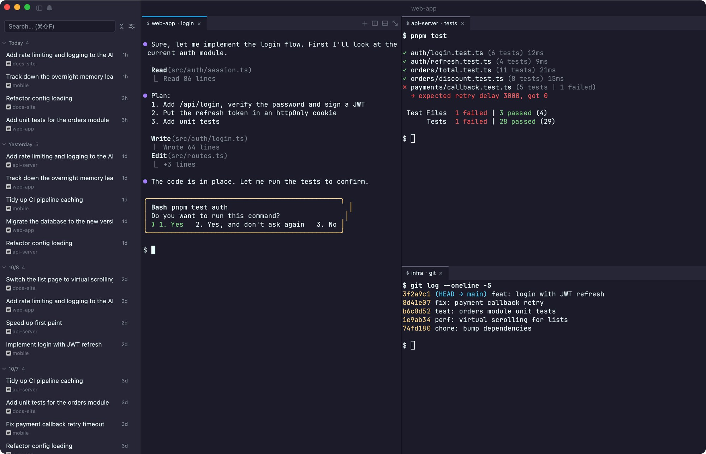
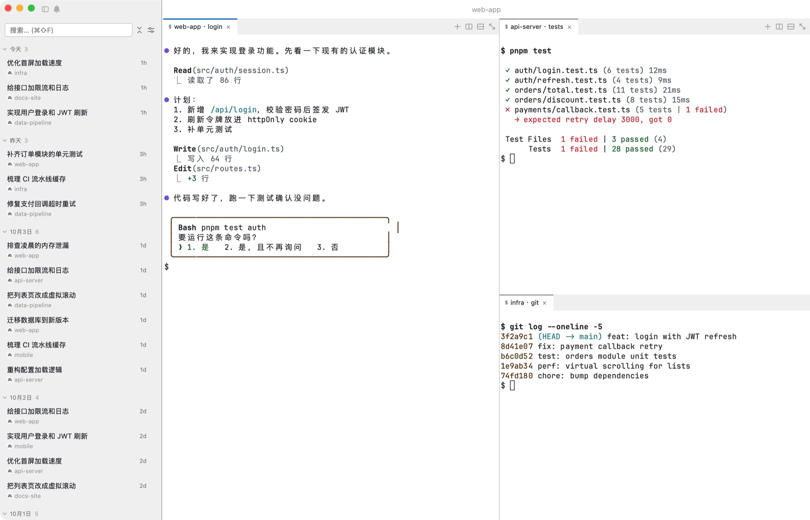
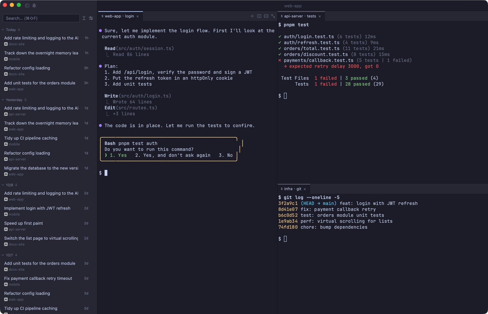
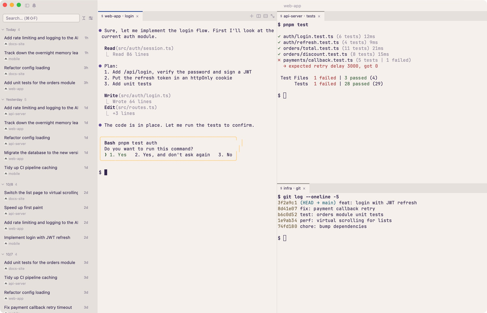
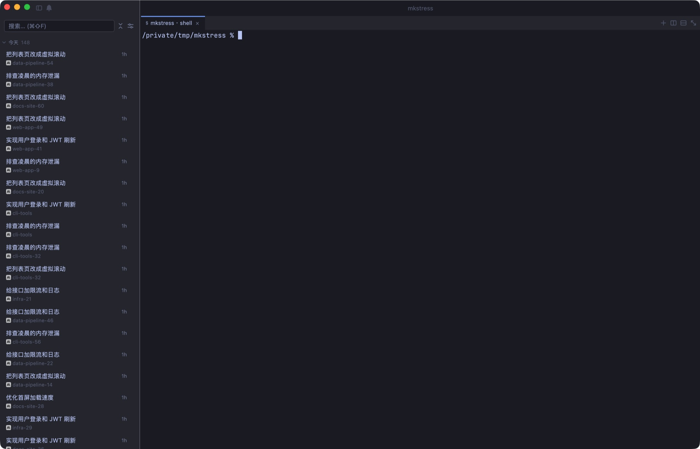

<h1 align="center">makit</h1>

<p align="center"><b>Make It Happen —— 让任务成真</b></p>

<p align="center">
  把散落在各个终端窗口里的 AI 编码会话收进一个界面：<br>
  看得到哪个在跑、哪个在等你、哪个早就停了，点一下就能回到任何一个。
</p>

简体中文 | [English](README.en.md)

<p align="center">
  <a href="#许可"></a>
  
  
  
</p>

<p align="center">
  <a href="#安装">安装</a> ·
  <a href="#快速开始">快速开始</a> ·
  <a href="#快捷键">快捷键</a> ·
  <a href="#它会碰你哪些东西">隐私说明</a> ·
  <a href="#从源码构建">从源码构建</a>
</p>

原生应用（Rust + GPUI，不是 Electron 套壳），0.1 先发 macOS，Linux、Windows 正在做。支持 **Claude Code** 和 **Codex**。

⭐ **觉得有用的话，欢迎 Star 和 Fork。** 用着不顺、想要什么功能，直接提 [Issue](https://github.com/nicholas-hoult/makit/issues) 就行；也欢迎 PR。

<p align="center">
  
</p>

> **0.1，先说清楚三件事**
> - 只发 macOS（Intel + Apple Silicon 通用包）。Linux 计划 0.2，Windows beta 计划 0.3。
> - **没有签名**，第一次打开需要手动放行（下面有步骤）。签名和公证要等有了开发者账号。
> - 需要你本机已经装好 Claude Code 或 Codex。makit 不代替它们，只是管理它们的会话。

---

## 它解决什么

开三个项目，每个项目挂着一个 AI 会话：A 在等你批一个重构，B 刚跑完测试，C 的 bug 还在修。终端窗口散在四处，哪个还活着、哪个在等你，只能一个个点开看。

makit 把这件事变成一屏：

- **会话列表** — 扫描本机已有的会话，按项目归组，显示每个的状态（运行中 / 等待审批 / 空闲 / 已停止 / 已归档）
- **一键恢复** — 选中历史会话直接接着聊，回到它原来的工作目录（Claude Code 的会话即使原目录被删也能救回来）
- **分屏终端** — 树形分屏，可拖拽调整，一屏盯住多个会话
- **状态通知** — 会话在等你时弹桌面通知（仅 Claude Code）

---

## 特点

- **轻** — 不是套壳网页：纯 Rust + GPUI 原生绘制。安装包 7.7 MB（单架构 `.dmg`），Intel + Apple Silicon 通用包约 15 MB
- **快** — 从启动到侧栏列出会话约 0.55 秒；空闲内存约 75 MB，1200 个会话也一样（数据和测法见下面「性能」）
- **美** — 21 套精选主题（深色 11 套、浅色 10 套），自动跟随系统深浅色，也能直接导入 iTerm2 的 `.itermcolors`
- **跨平台** — 目标是 macOS / Linux / Windows 三端。**0.1 先发 macOS**，Linux 计划 0.2、Windows 计划 0.3，还在做，没有成品

### 界面

<table>
  <tr>
    <td></td>
    <td></td>
    <td></td>
  </tr>
  <tr>
    <td align="center">GitHub Light</td>
    <td align="center">Catppuccin Mocha</td>
    <td align="center">Dayfox</td>
  </tr>
</table>

### 性能

在 **1200 个会话**（60 个项目 × 20 个会话）的侧栏：

<p align="center">
  
</p>

| 指标 | 实测 |
|---|---|
| 安装包（`.dmg`，单架构） | 7.7 MB |
| 可执行文件（单架构） | 18.9 MB |
| 启动到侧栏出现会话 | 约 0.55 秒（24 / 600 / 1200 个会话分别是 567 / 553 / 577 ms） |
| 空闲内存（RSS） | 73 MB（24 个会话）→ 77 MB（1200 个会话） |

**测试条件**：Intel Core i7-1068NG7（2.3 GHz，4 核），macOS 26.6.2，release 构建。

**说明**：
- 这是 Intel 机器上的数据，Apple Silicon 上没测，可能更好。
- 测试用的会话文件很小（每个 2 行）。真实会话动辄几 MB，首次扫描更慢（之后有缓存，只读新增部分），所以真实数据下的启动时间会比上面长。
- 第一次启动一个新下载的程序，macOS 会多花一点时间校验，上表是之后的稳定值。
- 复现：`python3 native/scripts/fake-sessions.py /tmp/mk 60 20`，再用 `HOME=/tmp/mk` 启动打包好的 `makit`。

---

## 名字和故事

**makit** 有两层意思：*make it*（让它发生）和 *make + kit*（做事的工具包）。口号是 **Make It Happen —— 让任务成真**。

起因很具体：周三下午在做登录功能，屏幕上开着编辑器、终端，还有两三个 AI 编码会话，一个在等你批准、一个刚跑完、一个停在昨天。第二天你想不起昨天讨论到哪了，只能在几十个对话里翻那个关于"登录"的会话；或者终端窗口散在四处，哪个还活着、哪个在等你，只能一个个点开看。

AI 工具是围绕**会话**组织的，而开发者想的是**任务**——"登录功能做完了吗"，而不是"第 5 个会话在哪"。makit 先做最基础的一步：把散落的会话收进一个界面，看得见状态，点一下就回得去。

---

## 安装

### 下载

0.1 只有 macOS 通用包，Intel 和 Apple Silicon 共用同一个文件。

**[→ 前往 Releases 下载最新版](https://github.com/nicholas-hoult/makit/releases)**（0.1 还没发布，之前可以按文末「从源码构建」自己打包）

下载 `.dmg`，打开后把 makit 拖进「应用程序」。

### 第一次打开（未签名，必须这一步）

因为包没有签名，直接双击会被 macOS 拦下来。任选一种：

**方式一：系统设置放行**

1. 双击 `makit.app`，会看到「无法打开」的提示，点「完成」
2. 打开 **系统设置 → 隐私与安全性**，往下拉，会看到「已阻止 makit」
3. 点 **仍要打开**，再确认一次

**方式二：命令行去掉隔离标记**

如果提示的是「**已损坏，无法打开**」（从浏览器下载的包常见），执行：

```bash
xattr -dr com.apple.quarantine /Applications/makit.app
```

然后正常双击打开。

> 这两步是所有未签名 app 都要做的，不是 makit 特有。不放心的话，源码全在这儿，可以自己构建（见文末）。

### 前置依赖

makit 管理的是**你已经装好的** AI CLI，所以至少要有其中一个：

- [Claude Code](https://claude.ai/code)
- [Codex](https://github.com/openai/codex)

一个都没装的话，makit 打开后会是空的。

---

## 快速开始

1. 打开 makit，左侧会列出扫描到的会话
2. `⌘K` 搜项目或任务，回车恢复
3. `⌘T` 开一个新终端标签，在里面直接敲 `claude` 或 `codex` 也行
4. `⌘D` 左右分屏，一屏看两个会话

---

## 快捷键

最常用的几个：

| 按键 | 作用 |
|---|---|
| `⌘K` | 命令面板：搜项目 / 任务，回车恢复会话 |
| `⌘T` | 新建终端标签 |
| `⌘D` / `⌘⇧D` | 左右 / 上下分屏 |
| `⌘L` | 在侧栏里定位当前标签对应的会话 |
| `⌘,` | 设置 |

<details>
<summary>全部快捷键</summary>

**会话**

| 按键 | 作用 |
|---|---|
| `⌘K` | 命令面板：搜项目 / 任务，回车恢复会话 |
| `⌘⇧F` | 聚焦侧栏搜索框 |
| `⌘L` | 在侧栏里定位当前标签对应的会话 |
| `⌘B` | 折叠 / 展开侧栏 |
| `⌘I` | 通知中心 |
| `⌘R` | 重新扫描会话列表 |
| `⌘,` | 设置 |

**标签**

| 按键 | 作用 |
|---|---|
| `⌘T` | 新建终端标签 |
| `⌘W` | 关闭当前标签（连同里面跑着的进程） |
| `⌘1` ~ `⌘9` | 切到当前分屏的第 N 个标签 |
| `⌘[` `⌘]`、`⌘←` `⌘→` | 上一个 / 下一个标签（循环） |
| `⌃Tab`、`⌃⇧Tab` | 同上 |

**分屏**

| 按键 | 作用 |
|---|---|
| `⌘D` | 左右分屏 |
| `⌘⇧D` | 上下分屏 |
| `⌥⌘1` ~ `⌥⌘9` | 切到第 N 个分屏 |
| `⌥⌘` + 方向键 | 切到相邻分屏 |
| `⌥⌘↩` | 最大化 / 还原当前分屏 |

**终端内**

| 按键 | 作用 |
|---|---|
| `⌘F` | 在当前终端里搜索 |
| `⌘=` `⌘-` `⌘0` | 字号放大 / 缩小 / 恢复 |
| `⌘` + 点击路径 | 打开那个文件或目录（相对路径按当前目录解析） |

> **`⌃` 开头的组合一律不拦**：`⌃C`、`⌃R`、`⌃L`、`⌃D` 等原样交给终端里的程序，makit 不截。唯一的例外是 `⌃Tab` 切标签。

完整列表在 app 内的设置面板里。

</details>

---

## 支持哪些 AI CLI

两种，但**能力不一样**，装之前请看清楚：

| | Claude Code | Codex |
|---|---|---|
| 扫描本机已有会话 | ✅ | ✅ |
| 恢复历史会话 | ✅ | ✅ |
| 新建会话 | ✅ | ✅ |
| 运行 / 等待状态 | ✅ | ❌ 一律显示「已停止」 |
| 桌面通知 | ✅ | ❌ |
| 悬停详情卡（目录、分支、首条 / 末条话题） | ✅ | ✅ |
| 启动目录被删后的恢复 | ✅ | 不适用（Codex 不按目录索引会话） |

**为什么不对称**：makit 的运行状态不是自己探测出来的，是读 Claude Code 写在 `~/.claude/sessions/<pid>.json` 里的状态。Codex 没有等价的东西，所以它的会话能管、能恢复，但看不出「在跑还是在等你」。

Codex 这条路还没在真机上全面验证，0.1 当它是**已知限制**而不是成品。

其他 CLI（Gemini 等）暂不支持。

---

## 它会碰你哪些东西

一个未签名的、要读 `~/.claude` 的 app，你有权知道它具体干什么。全部如下：

**读取**

- `~/.claude/projects/`、`~/.claude/sessions/`、`~/.codex/sessions/` — 扫描已有会话，用来生成列表和状态

**写入**

- `~/.claude/makit/` — makit 自己的数据：设置、归档记录、图标缓存、日志（`logs/`，只留最近 7 天，不含对话内容）、hook 通信用的 socket。删掉它不会影响你的会话
- `~/.claude/projects/` — **只有你对「启动目录已被删除 / 改名」的 Claude Code 会话点了恢复**，makit 才会在这里建一个符号链接，让 Claude Code 在原来的位置找到那段对话；其余时候不写
- `~/.claude/settings.json` — **只有你点了「安装 hook」按钮才会写**。不装 hook，makit 一个字都不会改它

**网络**

- 只有一个请求：第一次显示工具图标时下载 `anthropic.com` / `openai.com` 的 favicon，存在本地，以后不再请求
- 不上传任何东西，没有遥测，没有账号

**进程**

- 你在 makit 里开的终端，**关掉标签页就会关掉里面的一切** —— 包括你在那个标签里手动起的后台进程（dev server 之类）。这是刻意的：一个标签就是一个会话，不该在你关掉之后还在后台烧内存和 token。要留着的进程请在 makit 之外跑。

---

## 已知问题

目前没有已确认的阻塞性问题。碰到问题欢迎提 issue，请附上 makit 版本（设置 → 关于）、macOS 版本和「复制诊断信息」的内容。

---

## 路线图

- [x] 会话扫描、恢复、状态显示
- [x] 分屏终端、标签拖拽
- [x] 命令面板和搜索
- [x] 关掉标签页彻底清理会话进程
- [ ] 首次启动引导
- [ ] 版本更新提示
- [ ] Linux（0.2）
- [ ] Windows beta（0.3）

---

## 从源码构建

```bash
git clone https://github.com/nicholas-hoult/makit.git
cd makit

# 开发模式（日常用 --fast：依赖开优化、自己的代码仍是 debug；第一次编译要几分钟到二十几分钟）
bash native/scripts/dev.sh --fast

# 打包 .app（release 构建，本机签名）
bash native/scripts/bundle.sh
# 产物在 .worktrees/.target-gpui/release/bundle/makit.app（在主目录跑）；没有 .worktrees 时在 native/target/release/bundle/
```

环境要求：macOS、Rust stable。

> 仓库里的 `src-tauri/` 和 `src/` 是 0.1 之前的旧版（Tauri + React），已经冻结、不再维护，现在的应用在 `native/` 和 `core/` 里。

跑测试：

```bash
cargo test --manifest-path native/Cargo.toml   # 主程序
cargo test --manifest-path core/Cargo.toml     # 会话扫描、恢复等核心
```

---

## 技术栈

纯 Rust：界面是 [GPUI](https://www.gpui.rs/)（Zed 的 UI 框架），终端内核是 [alacritty_terminal](https://github.com/alacritty/alacritty)。构建产物是自包含的 `.app`，装完不需要 Node 或 Rust。

---

## 参与

- ⭐ 觉得有用，点个 **Star**；想改点什么，**Fork** 之后随便折腾
- 碰到问题或想要新功能，开 [Issue](https://github.com/nicholas-hoult/makit/issues)（模板里会提示附上版本号和诊断信息）
- 改动想合进来，直接提 PR；比较大的改动建议先开 Issue 聊一下

---

## 许可

双许可，任选其一：

- [MIT](LICENSE-MIT)
- [Apache License 2.0](LICENSE-APACHE)

除非你另外明确说明，你提交到本项目的任何贡献，都按上述双许可发布，不附加其他条款。

## 致谢

- [GPUI](https://www.gpui.rs/)、[alacritty_terminal](https://github.com/alacritty/alacritty) —— 这个 app 的地基
- [Claude Code](https://claude.ai/code) —— 先有了它带来的工作方式，才有管理这种工作方式的需求
